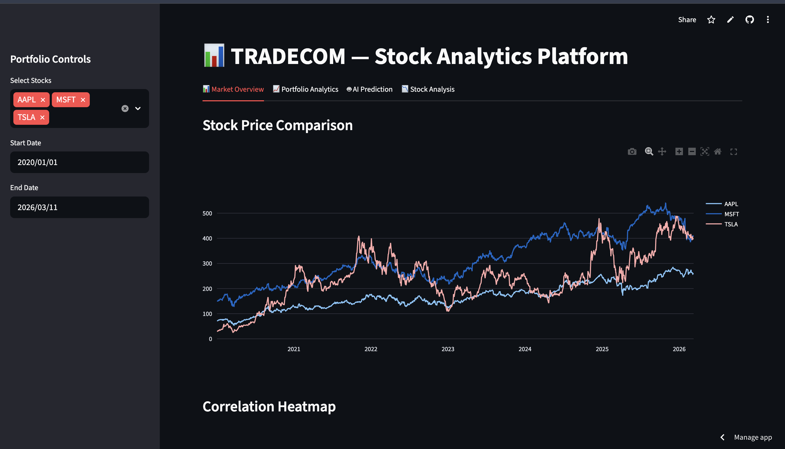
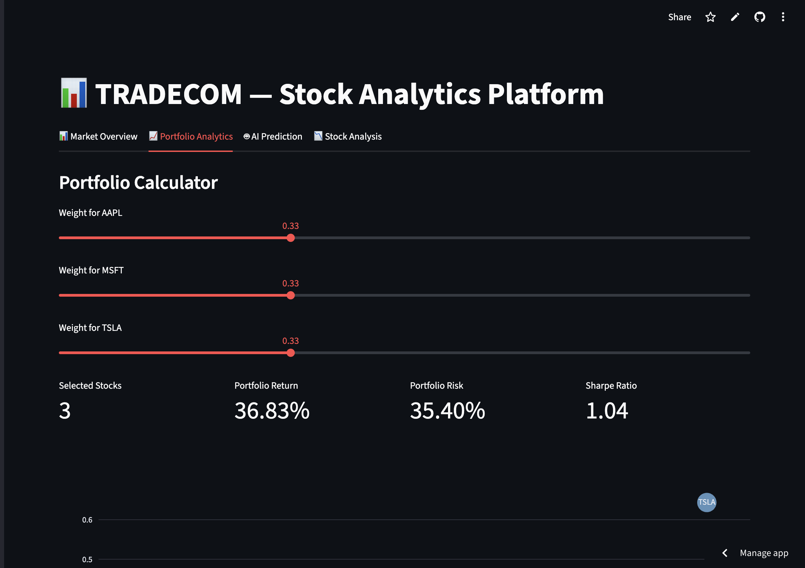
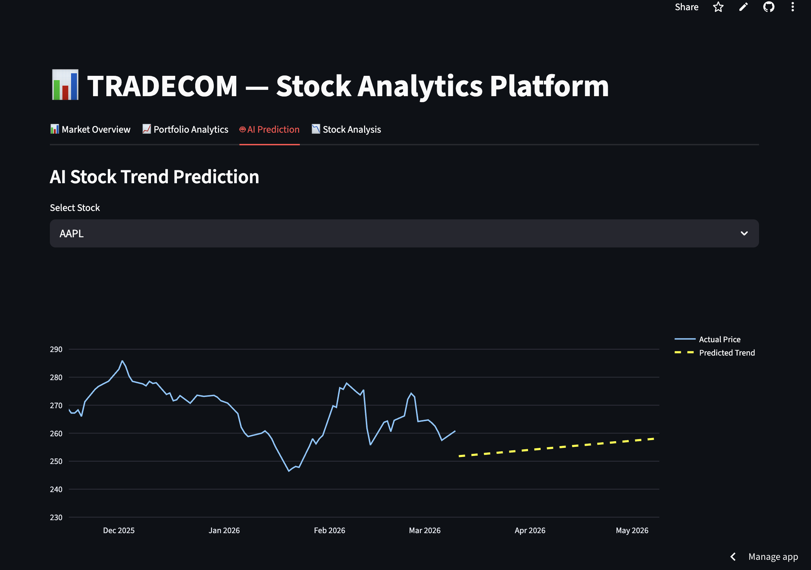
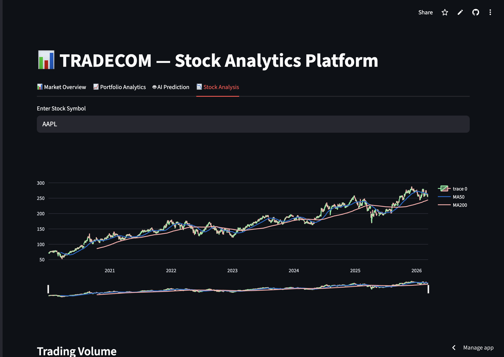

# 📊 TRADECOM — AI-Powered Stock Analytics Platform


🚀 **TRADECOM** is an interactive **AI-powered stock analytics dashboard** built using **Python, Streamlit, and real-time financial data**.

It enables users to analyze stock performance, simulate investment portfolios, and explore financial insights using **quantitative finance techniques and machine learning models**.

🔗 **Live Demo:**  
https://tradecom.streamlit.app/

🔗 **GitHub Repository:**  
https://github.com/harsh1223-bit/TradeCom

---

# 📷 Dashboard Preview

## 📊 Market Overview


## 📈 Portfolio Analytics


## 🤖 AI Prediction


## 📉 Technical Stock Analysis


---

# 🚀 Key Features

## 📊 Market Overview
- Multi-stock price comparison
- Interactive financial charts
- Correlation heatmap between selected assets
- Real-time financial data using Yahoo Finance API

---

## 📈 Portfolio Analytics
Advanced portfolio evaluation tools including:

- Portfolio return calculation
- Portfolio volatility analysis
- Sharpe Ratio evaluation
- Portfolio allocation visualization
- Portfolio backtesting simulation
- Monte Carlo portfolio simulation
- Interactive **Efficient Frontier optimizer**

---

## 🤖 AI-Driven Stock Prediction

Machine learning model used for forecasting stock trends.

Features include:

- Linear Regression model for stock price prediction
- 60-day future price forecast
- Historical vs predicted price visualization
- Interactive prediction charts

---

## 📉 Technical Stock Analysis

Advanced charting tools including:

- Candlestick charts
- Moving averages (MA50 & MA200)
- Trading volume visualization
- Trend analysis

---

# 🧠 Quantitative Finance Techniques Used

### Expected Portfolio Return

```
E(Rp) = Σ wi * E(Ri)
```

### Portfolio Risk (Volatility)

```
σp = √( wᵀ Σ w )
```

Where:

- **w** = portfolio weights  
- **Σ** = covariance matrix  
- **R** = expected returns  

The system evaluates:

- Expected portfolio return
- Portfolio volatility
- Sharpe ratio
- Optimal asset allocation

---

# 🔬 Portfolio Simulation

The dashboard uses **Monte Carlo simulation** to generate thousands of possible portfolios.

This allows users to:

- Visualize risk-return tradeoffs
- Identify optimal portfolios
- Simulate investment performance

---

# 🧰 Tech Stack

### Programming
Python

### Data Analysis
Pandas  
NumPy  

### Machine Learning
Scikit-learn  

### Visualization
Plotly  
Streamlit  

### Financial Data
Yahoo Finance API (`yfinance`)

---

# 📂 Project Structure

```
TradeCom
│
├── app.py
├── requirements.txt
├── README.md
└── screenshots/
```

---

# ⚙️ Installation

### Clone the Repository

```bash
git clone https://github.com/harsh1223-bit/TradeCom.git
```

### Navigate to Project Folder

```bash
cd TradeCom
```

### Install Dependencies

```bash
pip install -r requirements.txt
```

### Run the Dashboard

```bash
streamlit run app.py
```

Open in browser:

```
http://localhost:8501
```

---

# ☁️ Deployment

The dashboard is deployed using **Streamlit Cloud**.

Steps to deploy:

1. Push project to GitHub  
2. Go to https://streamlit.io/cloud  
3. Connect GitHub repository  
4. Select `app.py`  
5. Deploy  

Live version:

https://tradecom.streamlit.app/

---

# 📊 Skills Demonstrated

This project demonstrates expertise in:

- Data Analysis
- Financial Modeling
- Machine Learning
- Time Series Analysis
- API Integration
- Portfolio Optimization
- Interactive Dashboard Development

These skills are relevant for **Data Analyst, FinTech, and Quantitative roles**.

---

# 🚀 Future Improvements

Planned enhancements include:

- LSTM deep learning price prediction
- Real-time market data streaming
- Portfolio risk metrics (VaR / CVaR)
- Cryptocurrency analytics
- Automated trading strategy backtesting

---

# 👨‍💻 Author

**Harsh Sharma**

GitHub:  
https://github.com/harsh1223-bit

---

# ⭐ Support

If you like this project, consider giving the repository a **star ⭐ on GitHub!**